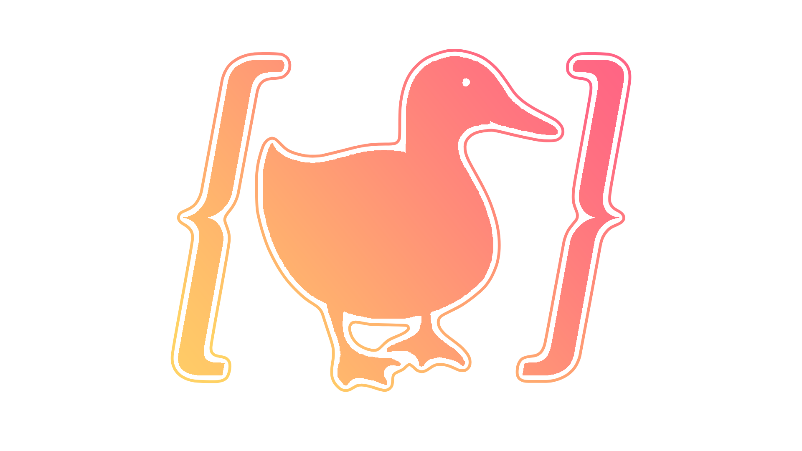

<!-- Logo pessoal -->

  

<h1 align="center">For my Resumé, Click on the Duck Logo!</h1>
<h1 align="center">Para o meu Currículo, Clique no Logo de Pato!</h1>

---

# 🧠 Fernando Bezerra (Nandobez)

**`Cientista de Dados | Cientista da Computação | Criador Técnico`**
**`Data Scientist | Computer Scientist | Technical Creator`**

Sou um apaixonado por tecnologia, arte e matemática, ciência de dados e desenvolvimento de soluções. Desde o ensino médio exploro programação, tanto em hardware quanto software. Meu objetivo é transformar dados em conhecimento útil, aplicando princípios sólidos de programação, estatística e design técnico para resolver problemas reais.

I'm passionate about technology, art and mathematics, data science, and solution development. Since high school, I've explored programming in both hardware and software. My goal is to transform data into useful knowledge by applying solid principles of programming, statistics, and technical design to solve real-world problems.

---

### 🎓 Formação Acadêmica | Education

📚 **Ciência da Computação (5º Semestre)**
Universidade de Fortaleza - UNIFOR · Fortaleza - 2025

📚 **Computer Science (5th Semester)**
University of Fortaleza - UNIFOR · Brazil - 2025

- Experiência com Python, Java, Spring Boot, Angular, React
- Experience with Python, Java, Spring Boot, Angular, React
- Paradigmas: OO, Aspectos, SOLID, Clean Code
- Paradigms: OOP, AOP, SOLID, Clean Code
- Análise de Dados com R, Pandas, Matplotlib, Seaborn
- Data Analysis with R, Pandas, Matplotlib, Seaborn
- Banco de Dados: PostgreSQL, MySQL, SQL Server
- Databases: PostgreSQL, MySQL, SQL Server
- Machine Learning e IA com PyTorch, TensorFlow, Scikit-Learn
- Machine Learning and AI with PyTorch, TensorFlow, Scikit-Learn
- Documentação com LaTeX (Overleaf), Swagger
- Documentation with LaTeX (Overleaf), Swagger

---

### 🧠 Perfil Profissional | Professional Profile

Sou autodidata, curioso e guiado por dados. Atuo com análise descritiva, visualização de dados, desenvolvimento de sistemas escaláveis e modelos de Machine Learning. Tenho experiência prática em projetos acadêmicos e comerciais, incluindo trabalho nos laboratórios **LAPIN** e **LARI**, e atualmente na **Doctor Home**, desenvolvendo soluções tecnológicas baseadas em boas práticas de engenharia de software.

I'm self-taught, curious, and data-driven. I work with descriptive analysis, data visualization, scalable systems development, and Machine Learning models. I have hands-on experience in academic and commercial projects, including work at **LAPIN** and **LARI** labs, and currently at **Doctor Home**, developing technological solutions based on software engineering best practices.

- Inglês nível C1
- English Level: C1
- Trabalho em equipe, proatividade e adaptabilidade
- Teamwork, proactivity, and adaptability
- Conhecimentos em finanças e investimentos
- Knowledge in finance and investment analysis

---

### 🧰 Tecnologias & Ferramentas | Technologies & Tools

#### 💻 Desenvolvimento e Ciência de Dados | Development & Data Science

  

#### 📊 Bibliotecas de Dados | Data Libraries

  

#### 🤖 Machine Learning & IA

  

#### 📈 Visualização e Dashboard | Visualization & Dashboards

  

#### 🌐 Front-End

  

#### 🖥️ Backend, DevOps & IOT

  

#### 🎮 Game Dev

  

#### 🎨 Design e Documentação | Design & Docs

  

---

### 🧪 Experiência | Experience

**🩺 Engenheiro de Software — Doctor Home, Fortaleza (2025–Presente)**
**🩺 Software Engineer — Doctor Home, Fortaleza (2025–Present)**
- Desenvolvimento de serviços médicos em larga escala com SpringBoot, Spring Security, React, PostgreSQL, Docker, RabbitMQ, GitHub CI/CD
- Large-scale medical services development with SpringBoot, Spring Security, React, PostgreSQL, Docker, RabbitMQ, GitHub CI/CD
- Modelagem, treinamento e aplicação de modelos de Machine Learning e IA voltados para área médica usando N8N, Ollama, Burn, PyTorch, TensorFlow, Scikit-Learn, Plotly/Dash, FastAPI, Skrobot
- Machine Learning and AI model design, training, and deployment for medical applications using N8N, Ollama, Burn, PyTorch, TensorFlow, Scikit-Learn, Plotly/Dash, FastAPI, Skrobot
- Criação de relatórios e documentação técnica usando LaTeX, Swagger e Shotgun
- Technical reports and documentation using LaTeX, Swagger, and Shotgun
- Design de UIs e protótipos
- UI Design and prototyping
- Data scraping e automação
- Data scraping and automation

**📊 Projetos Acadêmicos — UNIFOR (2022–Presente)**
**📊 Academic Projects — UNIFOR (2022–Present)**
- Desenvolvimento com Python, Java, Angular e React
- Development with Python, Java, Angular, and React
- Visualização e análise de dados com R, Pandas, Matplotlib, Seaborn
- Data visualization and analysis with R, Pandas, Matplotlib, Seaborn
- SQL e modelagem de dados (PostgreSQL, MySQL)
- SQL and data modeling (PostgreSQL, MySQL)
- Documentação técnica com LaTeX
- Technical writing with LaTeX
- Implementação de boas práticas SOLID e Clean Code
- Implementation of SOLID and Clean Code best practices

**🧬 Projetos no LAPIN & LARI — Fortaleza (2023–2024)**
**🧬 Projects at LAPIN & LARI Labs (2023–2024)**
- Aplicações com ciência de dados e análise descritiva
- Data science applications and descriptive analysis
- Desenvolvimento fullstack e pesquisa aplicada
- Fullstack development and applied research
- Versionamento e integração contínua com Git
- Versioning and CI/CD practices with Git
- Dashboards e visualização interativa de dados
- Dashboards and interactive data visualization
- Desenvolvimento de soluções tecnológicas para robótica
- Technological solutions development for robotics

---

### 🌐 Links

- 💼 GitHub: [github.com/Nandobez](https://github.com/Nandobez)
- 📧 Email: fernando.devsolutions13@gmail.com

---

### 📈 Estatísticas | GitHub Stats

 

---

> 🇧🇷 "Transformar curiosidade em conhecimento, e conhecimento em soluções."
> 🇺🇸 "Turning curiosity into knowledge, and knowledge into solutions."

🦆👍 QUACK!
